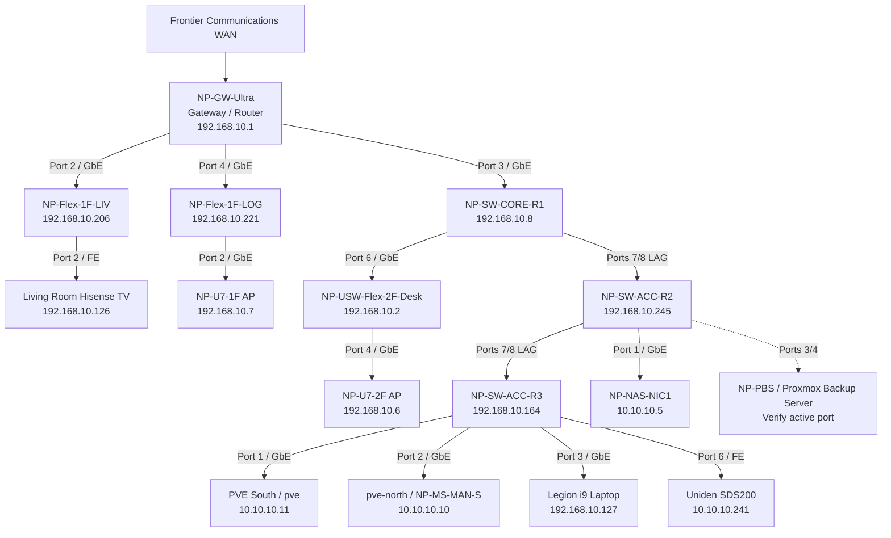

# North Pole Networks Topology Diagram

## Purpose

This document points to the current Mermaid topology diagram for the UniFi backbone.

Diagram source:

- `diagrams/north-pole-network-topology.mmd`

---

## Rendered Mermaid Source

---

## Notes

- This diagram intentionally avoids storing public WAN IP details.
- PBS cabling/status needs verification from the physical rack/switch.
- Some port labels in UniFi still need cleanup.
- Use `networking/switch-port-map.md` as the detailed port source.
